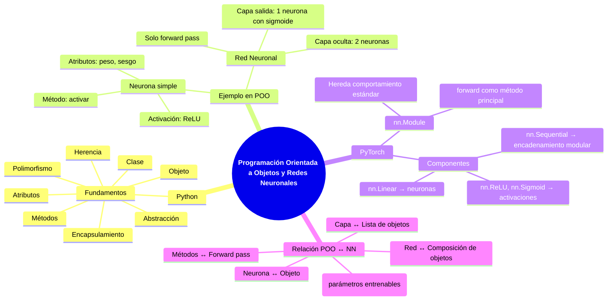

```mermaid
    mindmap
        root((**Programación Orientada a Objetos y Redes Neuronales**))
            Python
                Fundamentos
                    Clase
                    Objeto
                    Atributos
                    Métodos
                    Encapsulamiento
                    Herencia
                    Polimorfismo
                    Abstracción

            Ejemplo en POO
                Neurona simple
                    Atributos: peso, sesgo
                    Método: activar
                    Activación: ReLU
                Red Neuronal
                    Capa oculta: 2 neuronas
                    Capa salida: 1 neurona con sigmoide
                    Solo forward pass

            PyTorch
                nn.Module
                    Hereda comportamiento estándar
                    forward como método principal
                Componentes
                    nn.Linear → neuronas
                    nn.ReLU, nn.Sigmoid → activaciones
                    nn.Sequential → encadenamiento modular

            Relación POO ↔ NN
                Neurona ↔ Objeto
                Capa ↔ Lista de objetos
                Red ↔ Composición de objetos
                Métodos ↔ Forward pass
                Atributos ↔ Pesos y sesgos (parámetros entrenables)

```