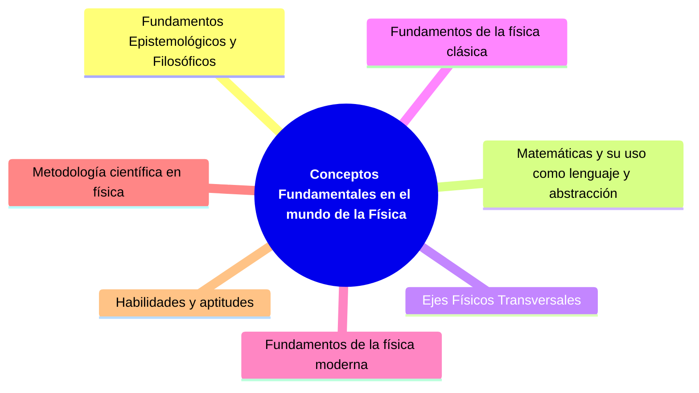
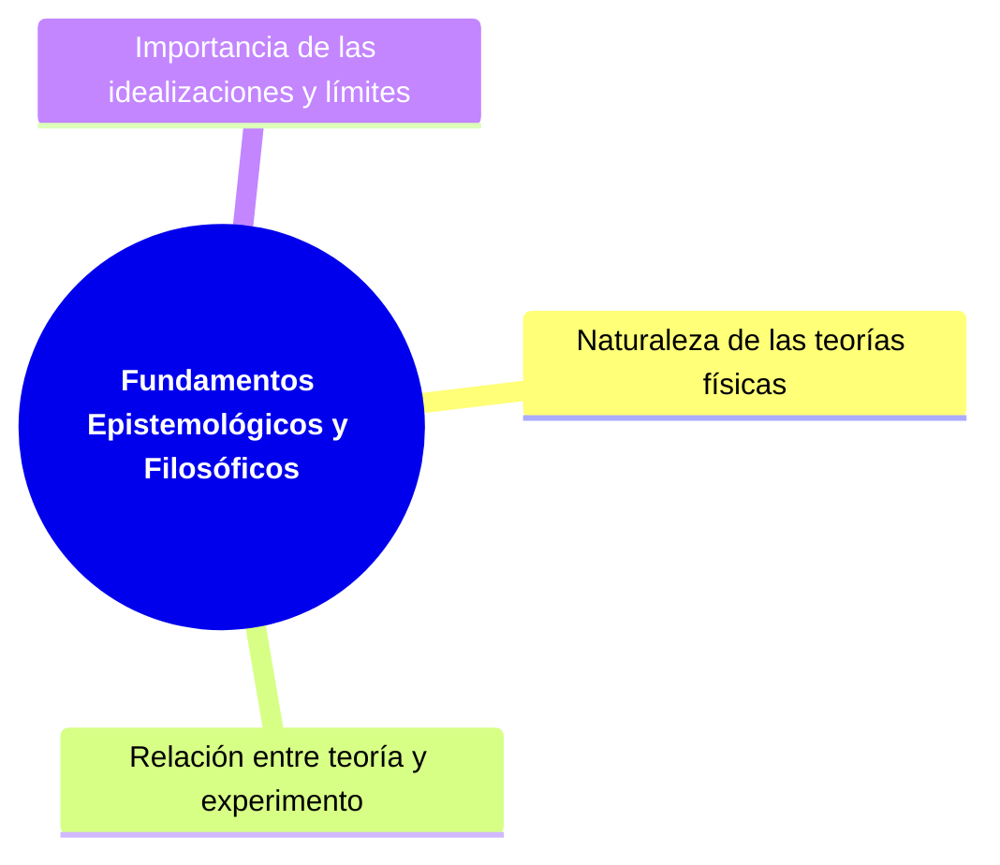
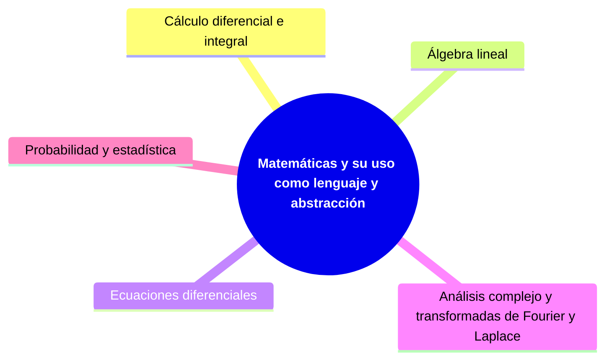
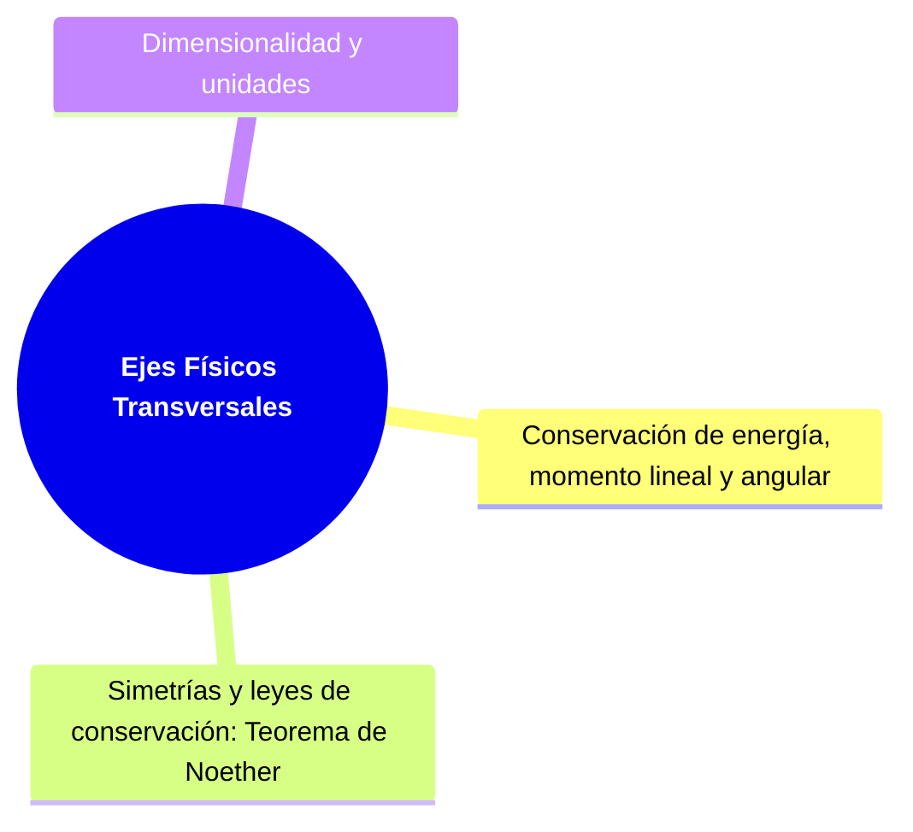
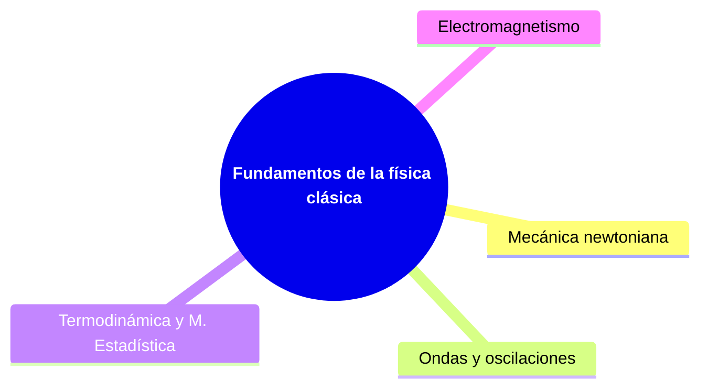
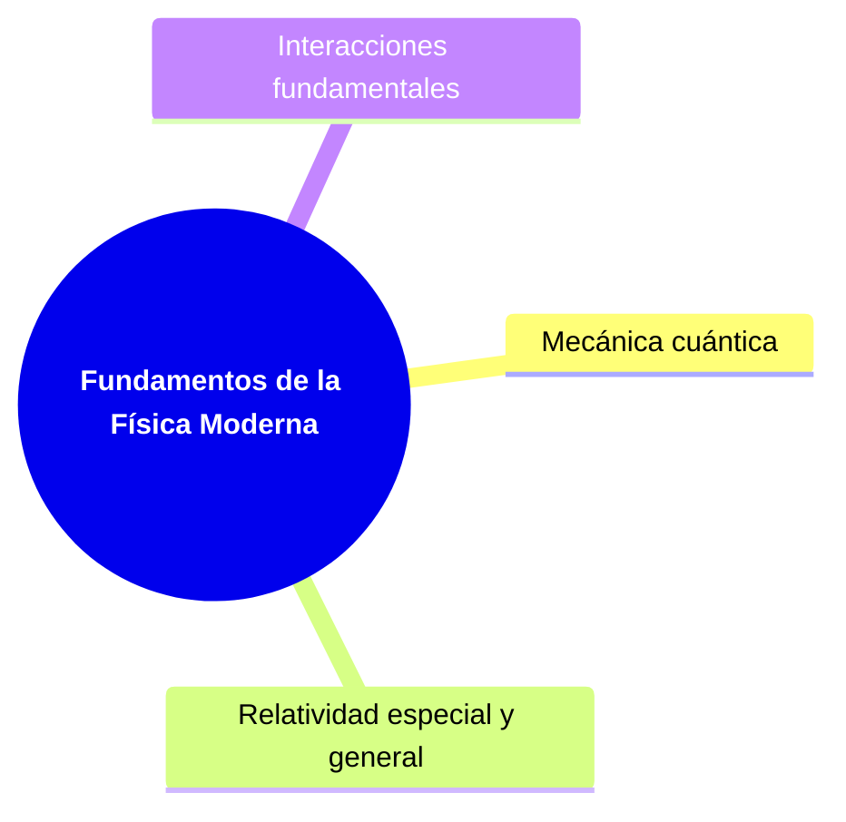
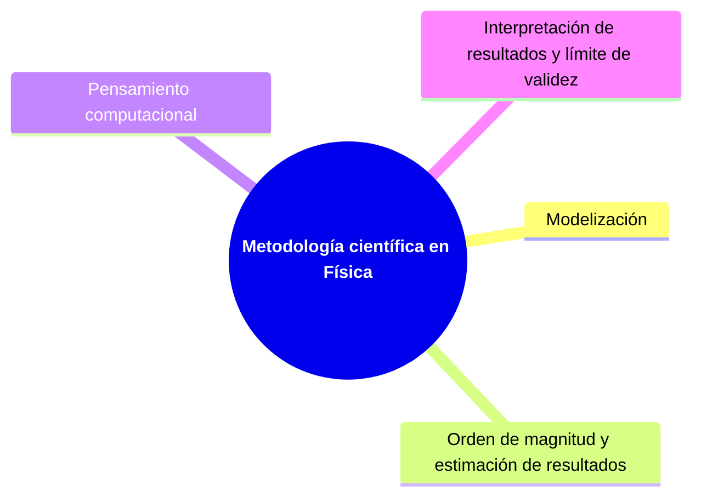
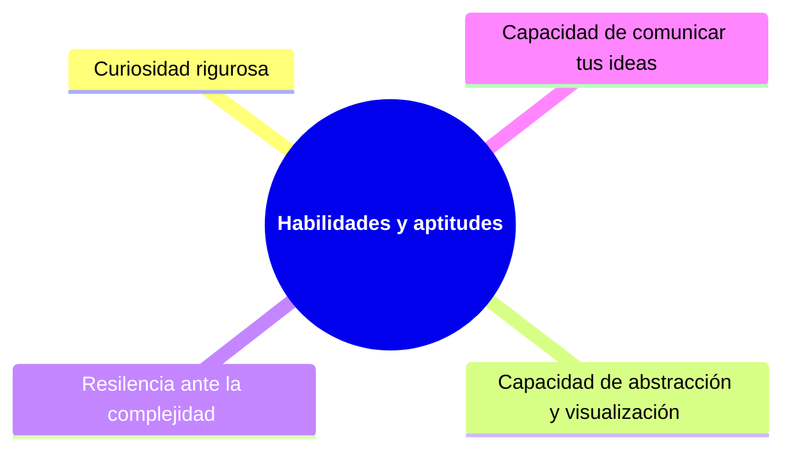

# Bitácora de Exploración: Conceptos fundamentales en el mundo de los físicos 

La siguiente bitácora tiene como objetivo explorar cuales son quizás los conceptos más fundamentales que un físico debería tener en su cajón de conocimientos. Se han divido en **siete** bloques.

---

| | |
|----------------------------------------|-------------|
| Naturaleza de las teorías físicas      | Es importante e interesante comprender que una teoría no es una verdad absoluta, sino un modelo para describir fenómenos en su mayoría observables. |
| Relación entre teoría y experimento    | Una buena teoría debe predecir resultados medibles, aquí se puede discutuir temas tales como si resultados experimentales deberían guíar los desarrollos teóricos o realmente depende del problema y su naturaleza |
| Importancia de las idealizaciones y límites | Saber cuándo y por qué se hacen simplificaciones (ejemplos de esto son las partículas puntuales y los sistemas cerrados). |

---

| | |
|-------------------------------|------------------------|
| Cálculo diferencial e integral         | Fundamento para describir cambios |
| Álgebra lineal                        | Es muy importante para mecánica cuántica, relatividad y teoría de campos. |
| Ecuaciones diferenciales              | Base para modelar sistemas físicos y su dinámica|
| Análisis complejo y transformadas (Fourier, Laplace) | Útiles en física teórica, óptica y sistemas dinámicos. |
| Probabilidad y estadística             | Para mecánica estadística, cuántica y análisis de datos experimentales. |

---

| | |
|----------------------------------------|-------------|
| Conservación de energía, momento lineal y angular | Principios guía internalizados. |
| Simetrías y leyes de conservación (Teorema de Noether) | Cómo las simetrías del sistema se traducen en leyes físicas. |
| Dimensionalidad y unidades             | Verificar coherencia dimensional en ecuaciones. |

---

| | |
|----------------------------------------|-------------|
| Mecánica newtoniana                    | Paradigma de sistema determinista. |
| Ondas y oscilaciones                   | Fundamento para acústica, óptica, mecánica cuántica y montón más. |
| Termodinámica y mecánica estadística   | Irreversibilidad, desorden y temperatura desde lo microscópico. |
| Electromagnetismo                      | Ecuaciones de Maxwell como teoría unificada. |

---

| | |
|----------------------------------------|-------------|
| Mecánica cuántica                      | Estados, operadores, superposición, función de onda, principio de incertidumbre. |
| Relatividad especial y general         | Espacio-tiempo como entidad geométrica y dinámica. |
| Interacciones fundamentales            | Descripción (modelo estándar) y diferencias entre ellas. |

---

| | |
|----------------------------------------|-------------|
| Modelización                           | Saber qué omite y resalta un modelo. |
| Orden de magnitud y estimaciones       | Juzgar plausibilidad de resultados. |
| Pensamiento computacional              | Simular y visualizar fenómenos complejos. |
| Interpretación de resultados y límites de validez | |

---

| | |
|----------------------------------------|-------------|
| Curiosidad rigurosa                    | Hacerse preguntas y buscar explicaciones profundas. |
| Capacidad de abstracción y visualización | Ver más allá de lo inmediato. |
| Resiliencia ante la complejidad        | Entender que los problemas requieren tiempo de maduración. |
| Capacidad de comunicar tus ideas         | Compartir física con claridad. |

---
