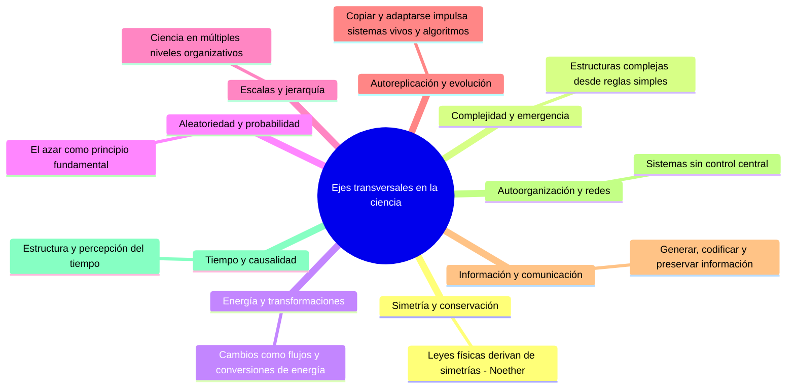

# Bitácora de exploración. Ejes transversales en la Ciencia.

El objetivo de esta pequeña bitácora es reconocer algunos de los ejes transversales que conectan distiintas disciplinas del conocimiento. Se puede definir a un **eje trasversal** como un *puente* entre diferentes disciplinas que permiten ver patrones entre areas del conocimiento aparentemente distintas.

| Eje transversal                    | Descripción                                                                     | Disciplinas asociadas                                         |
| ---------------------------------- | ------------------------------------------------------------------------------- | ------------------------------------------------------------- |
| **1. Simetría y conservación**     | Las leyes de la física derivan de simetrías → teorema de Noether                | Física, química, matemáticas, biología                        |
| **2. Complejidad y emergencia**    | Estructuras complejas emergen de reglas simples                                 | Biología, física, IA, sociología, neurociencia                |
| **3. Energía y transformaciones**  | Cambios en los sistemas se entienden a través del flujo y conversión de energía | Física, biología, ingeniería, economía                        |
| **4. Aleatoriedad y probabilidad** | El azar como principio fundamental y no sólo ignorancia                         | Mecánica cuántica, estadística, biología, finanzas            |
| **5. Escalas y jerarquía**         | La ciencia opera en múltiples niveles de organización y escala                  | Física, biología, computación, geología                       |
| **6. Autoreplicación y evolución** | La capacidad de copiar y adaptarse impulsa sistemas vivos y algoritmos          | Biología, IA, nanotecnología, astrobiología                   |
| **7. Información y comunicación**  | Cómo se genera, transmite, codifica y preserva la información                   | Física, computación, neurociencia, biología                   |
| **8. Autoorganización y redes**    | Sistemas que se organizan sin control central                                   | Física de sistemas complejos, biología, economía, informática |
| **9. Tiempo y causalidad**         | La percepción y estructura del tiempo; sus implicaciones físicas y cognitivas   | Relatividad, filosofía, neurociencia, historia, computación   |
