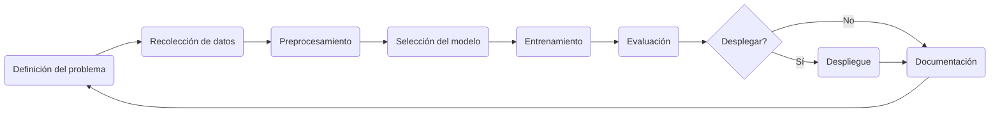

# Bitácora de Exploración: Etapas comunes de un proyecto de IA

### 1. **Definir el objetivo del proyecto.**

- ¿Qué se quiere resolver?(ej. clasificar imágenes, predecir valores, detectar anomalías).
- ¿Qué tipo de tarea es? (clasificación, regresión, clustering, generación, etc.)
- ¿Qué impacto tendrá el modelo en la toma de decisiones?

### 2. **Recolección y exploración de datos**

**En esta etapa se recopilan los datos necesarios y se realiza EDA (exploratory data analysis).**

- Identificar fuentes de datos disponibles (bases existentes, sensores, APIs, encuestas).
- Verificar la calidad, cantidad y variedad de los datos.
- Analizar distribuciones, valores nulos, correlaciones, etc.

### 3. **Preprocesamiento y limpieza de datos**

**Aquí lo que se hace es limpiar, transformar y seleccionar características útiles.**

- Imputación de valores nulos.
- Normalización o estandarización.
- Codificación de variables categóricas (One-hot, Label Encoding).
- Reducción de dimensionalidad si es necesario.
- Generación de nuevas variables (feature engineering).

### 4. **Selección del modelo**

**En este paso lo que se hace es escoge un algoritmo base según el tipo de problema (toca hacer investigación y aplicar la experiencia que se tiene)**

- Elegir un algoritmo base:
  - Regresión lineal, árboles de decisión, random forest, SVM, redes neuronales, etc.
  - Si es deep learning: CNN, RNN, Transformers, etc.
- Definir si se usará un modelo tradicional (scikit-learn) o redes profundas (TensorFlow, PyTorch).

### 5. **Entrenamiento del modelo**

**Aquí se entrena el modelo con la validación adecuada.**

- Dividir datos en conjunto de entrenamiento, validación y prueba.
- Definir métricas de evaluación.
- Ajustar hiperparámetros (manualmente, grid search, random search, Optuna).

### 6. **Evaluación y validación**

**Se evalua con métricas relevantes y se ajustan hiperparámetros.**

- Evaluar el modelo en datos no vistos (test set).
- Validación cruzada.
- Analizar errores y sesgos (confusion matrix, precision/recall, etc.).
- Interpretar el modelo (SHAP, LIME, feature importance).

### 7. **Despliegue del modelo (opcional)**

**Esta estapa en opcional ya que se decide si el modelo será usado en producción o es solo exploratorio (mantener en local)**

**En caso de que pase a producción se puede crea una API o servicio y monitorear su rendimiento.**

- Empaquetar el modelo como una API (FastAPI, Flask, Django).
- Monitorear su rendimiento en producción.
- Reentrenar cuando los datos cambien (concept drift).

### 8. **Documentación y entrega**

**Aunque está al final la documentación se va realizando en todo el proceso y ya al final se pule y se entregan resultados, código y análisis.**

- Explicar claramente el modelo, supuestos, datos usados, métricas obtenidas.
- Documentar código, pipelines y decisiones técnicas.
